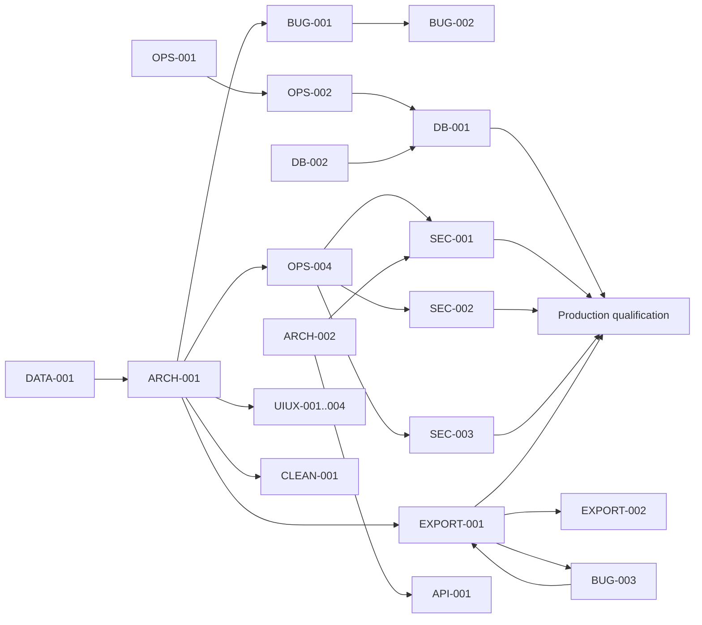

# Fix Dependency Graph

```mermaid
flowchart LR
 DATA[DATA-001] --> SRC[ARCH-001]
 SRC --> TEST[OPS-004]
 SRC --> COVER[BUG-001]
 COVER --> AIC[BUG-002]
 SRC --> TPL[EXPORT-001]
 TPL --> PRINT[EXPORT-002]
 TPL --> POLICY[BUG-003]
 TEST --> AUTH[SEC-001]
 TEST --> RESET[SEC-002]
 TEST --> SSRF[SEC-003]
 PM2[OPS-001] --> LIFE[OPS-002]
 LIFE --> READY[DB-001]
 FK[DB-002] --> READY
 ROUTES[ARCH-002] --> AUTH
 ROUTES --> REPLAY[API-001]
 SRC --> UI[UIUX-001..004]
 POLICY --> TPL
 SRC --> CLEAN[CLEAN-001]
 READY --> QUAL[Production qualification]
 AUTH --> QUAL
 RESET --> QUAL
 SSRF --> QUAL
 TPL --> QUAL
```

Shared migrations should land before services that depend on them. Feature flags should isolate partially delivered template/export work.
